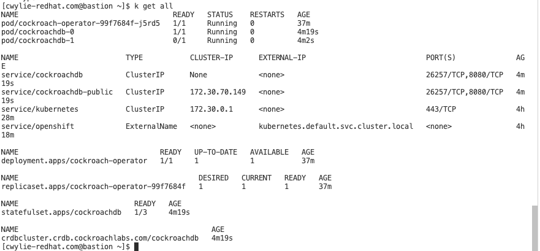
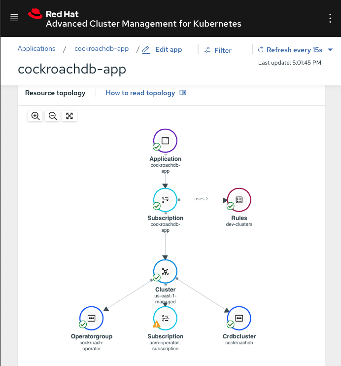

# Deploy Cockroach in RHACM
- [Prereqs](#prereqs)
- [Create application Namespace](#create-application-namespace)
- [Add Managed Cluster](#add-managed-cluster)
- [Create Application Resources](#create-application-resources)
- [Apply the Placement Rule to Deploy Application](#apply-the-placement-rule-to-deploy-application)
- [Validate through UI and other cluster](#validate-through-ui-and-other-cluster)

## Prereqs
Prerequisites for this lab include the following:
- ACM Hub Cluster with OpenShift 4.4 or greater
- ACM Managed Cluster

Next, let's setup an alias for `kubectl`
```
alias k=kubectl
alias ACM=open-cluster-management
```

## Create application Namespace
No need, we are going to deploy it to the default namespace which is the default for the `Cockroach Operator`.

## Add Managed Cluster
Add a manged cluster from the UI or from configuration. 

Label the managed cluster, this is an essential step to the `PlacementRules`
```
environment=dev
```


## Create Application Resources
_Apply the file containing the applicat, subscription, and channel on the hub cluster._

Before you apply this, i would encorage you to pay attention to the GitHub URL of in the `Channel` CR and the `apps.open-cluster-management.io/github-path` annotation in the `Subscription`, which shows which resources are being applied to the managed cluster.
```
k create -f apps/cockroach/application.yaml
```
**output**
```
channel.apps.open-cluster-management.io/cockroachdb-app-latest created
application.app.k8s.io/cockroachdb-app created
subscription.apps.open-cluster-management.io/cockroachdb-app created
```

## Apply the Placement Rule to Deploy Application
_You have the application and necessary components created at this point, you are ready to deploy to a target cluster. Apply a placement rule so that your subscription knows where to deploy the app._
```
k apply -f apps/cockraochdb/placement-rule-dev-clusters.yaml
```
**output**
```
placementrule.apps.open-cluster-management.io/dev-clusters created
```

## Validate through UI and other cluster

In the managed cluster:
```
k get all
```


